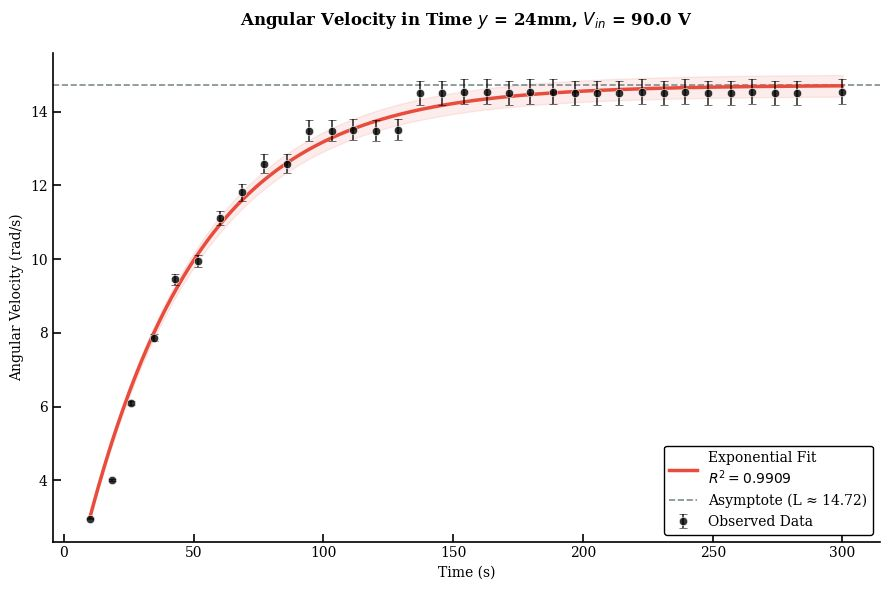
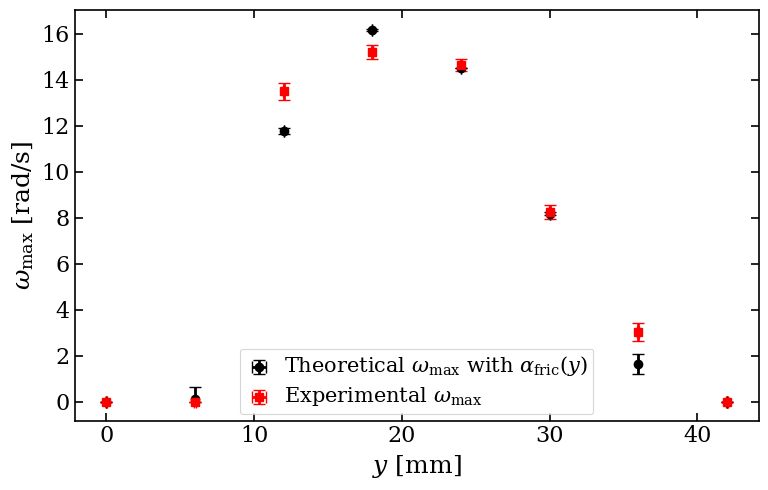
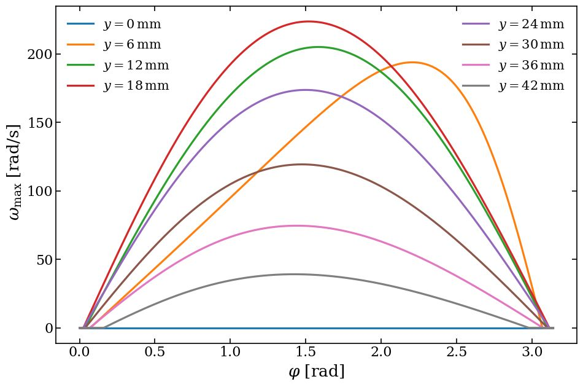
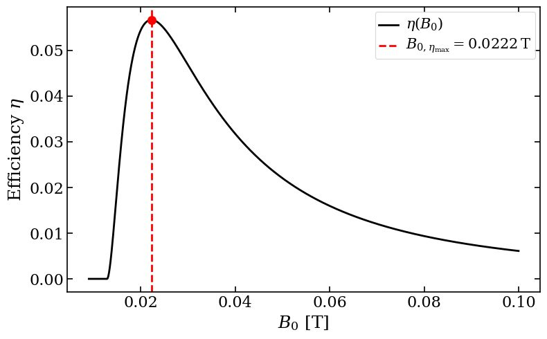
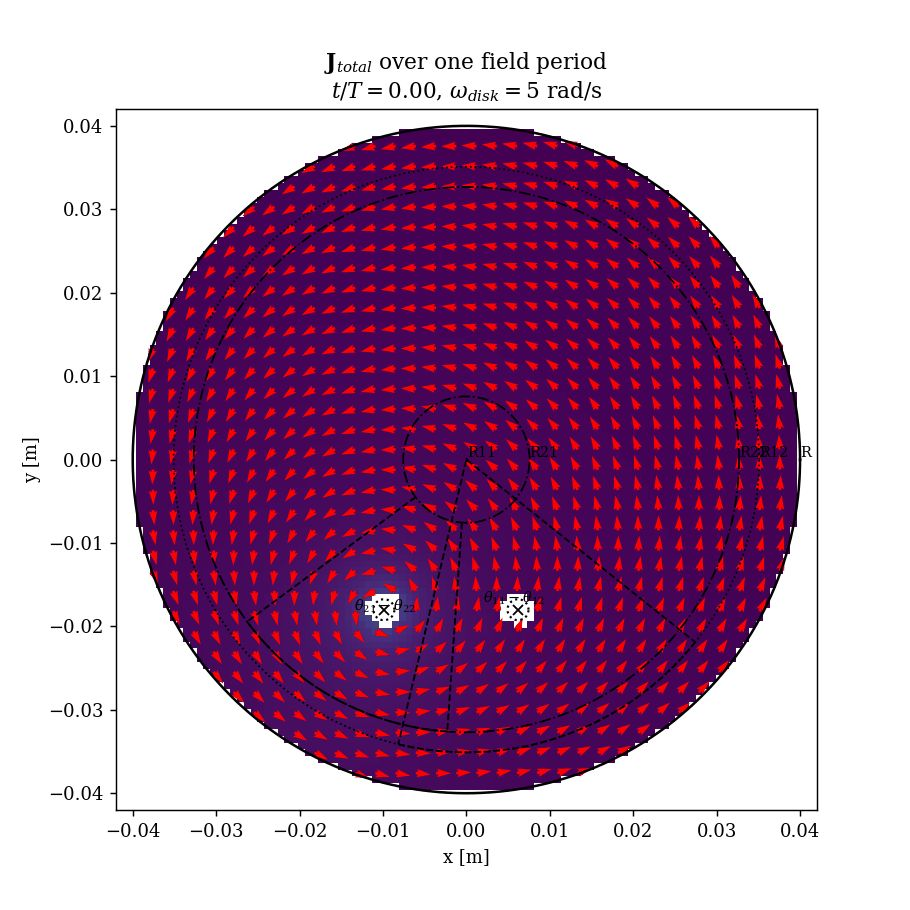
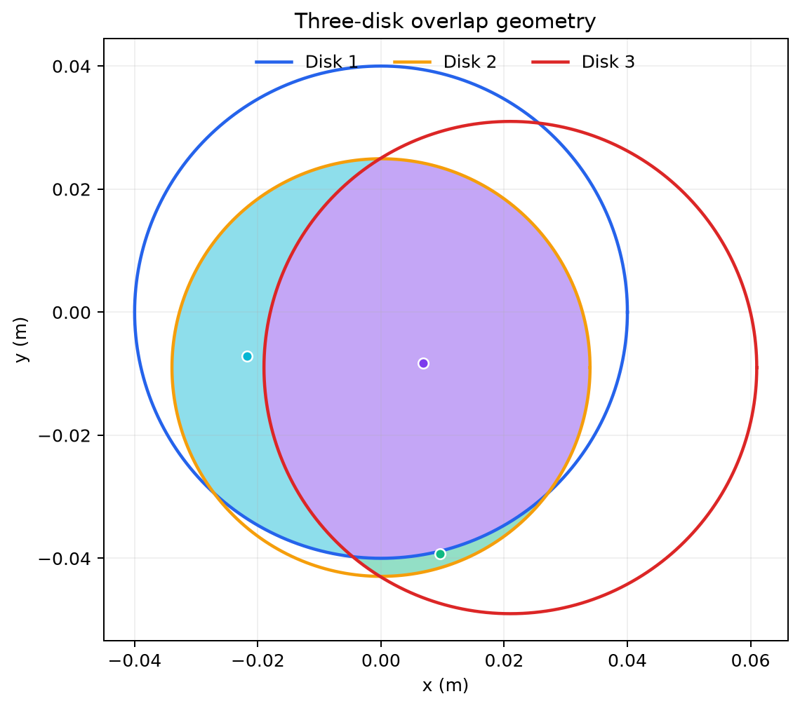

# Eddy Current Engine - IPT Problem 8

Reproducible Python implementation and experimental summary for the International Physicists' Tournament problem **Eddy Current Engine**. The project separates the measured response, three-disk geometry, phase-dependent electromagnetic drive, induced torque, and rotor dynamics so that each assumption can be inspected independently.

The figures below are the original embedded results from the 60-slide reporter presentation supplied with this project.

## IPT report results

### Measured angular-velocity transient

For a displacement of $y=24\,\mathrm{mm}$ and an input voltage of $V_{\mathrm{in}}=90.0\,\mathrm{V}$, the measured angular speed approaches

$$
\omega_\infty \approx 14.72\,\mathrm{rad\,s^{-1}}.
$$

The exponential fit reported in the presentation has $R^2=0.9909$.



### Theory versus experiment

The position sweep compares the terminal angular velocity predicted by the model, including the measured position-dependent friction coefficient $\alpha_{\mathrm{fric}}(y)$, against the experimental values. Both exhibit the same non-monotonic dependence on position and locate the high-speed region near $y=18$-$24\,\mathrm{mm}$.



### Angular-velocity optimization

The phase sweep shows that the relative phase $\varphi$ and disk position must be optimized together. In the reported parameter sweep, the largest theoretical angular velocity occurs near $y=18\,\mathrm{mm}$ and $\varphi\approx\pi/2$.



### Efficiency optimization

The reported efficiency is non-monotonic in magnetic-field amplitude. The model predicts an optimum at

$$
B_{0,\eta_{\max}}=0.0222\,\mathrm{T},
$$

with a peak efficiency of approximately $5.7\%$ for the parameters used in the presentation.



### Spatial current-density result

The analytic current solution produces the asymmetric current pattern responsible for the net torque in the shaded-field geometry.



Detailed provenance and the distinction between reported, digitized, and computed quantities are documented in [docs/results_provenance.md](docs/results_provenance.md).

## Geometry used by the numerical model



## Theory from the IPT presentation

This section follows the physical model and notation developed in slides 31-39 and in the theory appendix, slides 45-52. The engine is treated as a shaded-pole induction motor: two time-dependent magnetic-field regions overlap the conducting aluminium disk with a relative phase. Their changing flux produces eddy currents. Because the current pattern is spatially asymmetric, the cross-interaction between the current induced by one field and the other magnetic field produces a net torque.

### 1. Flux-preserving magnetic-field model

The presentation replaces each finite field patch by a concentrated source with the same magnetic flux. In polar coordinates on a disk of radius $R$,

$$
\mathbf{B}_1(\rho,\theta,t)
=\hat{\mathbf z}\,A_1B_{01}\cos(\Omega t)
\frac{1}{\rho}\delta(\rho-\rho_{01})\delta(\theta-\theta_{01}),
$$

$$
\mathbf{B}_2(\rho,\theta,t)
=\hat{\mathbf z}\,A_2B_{02}\cos(\Omega t-\varphi)
\frac{1}{\rho}\delta(\rho-\rho_{02})\delta(\theta-\theta_{02}).
$$

Here $A_1$ and $A_2$ are the disk areas threaded by the two fields, $(\rho_{0i},\theta_{0i})$ locate their effective centers, $\Omega$ is the electrical angular frequency, and $\varphi$ is the phase difference.

The second source is labelled consistently with the later derivation as $(\rho_{02},\theta_{02})$; the field-definition slide itself repeats the subscript $01$ on that line.

### 2. Induced electric field and eddy currents

For a stationary conductor, Ohm's law and the electrostatic correction inside the finite disk are

$$
\mathbf{J}_{\mathrm{tot}}=\sigma\mathbf{E}_{\mathrm{tot}},
\qquad
\mathbf{E}_{\mathrm{tot}}=\mathbf{E}_{\mathrm{ind}}-\nabla\Phi.
$$

The induced field is written with the two-dimensional Biot-Savart-like expression used in the presentation:

$$
\mathbf{E}_{\mathrm{ind}}(\mathbf r,t)
=\frac{1}{2\pi}\int_{\mathbb{R}^2}
\frac{\partial B_z(\mathbf r',t)}{\partial t}
\frac{\hat{\mathbf z}\times(\mathbf r-\mathbf r')}
{\lvert\mathbf r-\mathbf r'\rvert^2}\,d^2\mathbf r'.
$$

The induced field alone does not satisfy the disk boundary. Charge accumulates at the edge until the normal current vanishes:

$$
\left.\mathbf{J}\cdot\hat{\mathbf n}\right|_{\rho=R}=0,
\qquad
\left.E_{\mathrm{ind},\rho}\right|_{\rho=R}
=\left.\frac{\partial\Phi}{\partial\rho}\right|_{\rho=R}.
$$

Inside the disk, the harmonic potential can be expanded as

$$
\Phi(\rho,\theta)=A_0+
\sum_{n=1}^{\infty}\frac{\rho^n}{n}
\left[
\frac{\alpha_n}{R^{n-1}}\cos(n\theta)
+\frac{\beta_n}{R^{n-1}}\sin(n\theta)
\right],
$$

with, for field 1,

$$
\alpha_n=-\frac{1}{2\pi}
\frac{\dot B_1(t)\rho_{01}^{n}}{R^{n+1}}\sin(n\theta_{01}),
\qquad
\beta_n=\frac{1}{2\pi}
\frac{\dot B_1(t)\rho_{01}^{n}}{R^{n+1}}\cos(n\theta_{01}).
$$

The total field used to calculate the current density is therefore

$$
\mathbf{E}_{\mathrm{tot}}^{(1)}(\rho,\theta,t)
=\left(E_{\rho}^{(1)}(\rho,\theta,t),
E_{\theta}^{(1)}(\rho,\theta,t)\right)
=\mathbf{E}_{\mathrm{ind}}^{(1)}-\nabla\Phi.
$$

The closed analytic components and their spatial current-density visualization are implemented in `notebooks/Analytic_Current_Visualization.ipynb`.

### 3. Driving torque

The electromagnetic torque follows from the Lorentz force density:

$$
\boldsymbol{\tau}
=\int_V \mathbf r\times
\left[\mathbf J(\mathbf r)\times\mathbf B(\mathbf r)\right]\,dV.
$$

In the presentation, the self-term produced by $\mathbf J_n$ in its own field $\mathbf B_n$ gives zero net torque. The nonzero contribution comes from the cross-terms $\tau_{12}+\tau_{21}$ and is proportional to $\sin\varphi$. After collecting the geometry into $G_{\mathrm{drive}}$,

$$
\tau_{\mathrm{drive}}
=G_{\mathrm{drive}}(R,\rho_{01},\rho_{02},\theta_{01},\theta_{02})
A_1A_2B_0^2h\sigma\Omega\sin\varphi.
$$

Thus the phase lag created by the shaded-pole geometry is essential: the driving torque vanishes when $\varphi=0$ or $\pi$.

For the symmetric reference case $\rho_{01}=\rho_{02}=c$, $\theta_{01}=0$, and $\theta_{02}=\pi/2$, the appendix obtains

$$
\tau=
\frac{A_1A_2B_{01}B_{02}h(c^2-R^2)^2\sigma\Omega\sin\varphi}
{4\pi(c^4+R^4)},
$$

which reproduces the induction-motor reference result used in the presentation.

### 4. Motion-induced current and damping torque

Once the disk rotates, the current density includes the motional term:

$$
\mathbf J=\sigma\left(\mathbf E+\mathbf v\times\mathbf B\right).
$$

Under the magnetoquasistatic approximation,

$$
\nabla\cdot\mathbf J(\mathbf r,t)=0,
$$

and the free charge density associated with a rotating radial field profile is

$$
\rho_f(r,\theta,t)
=-\varepsilon_0\omega
\left(2B+r\frac{\partial B}{\partial r}\right).
$$

For an annular magnetic-field sector, the presentation models

$$
B(\rho,\theta,t)=B_0(t)
\Theta(\rho-R_1)\Theta(R_2-\rho)
\Theta(\theta-\theta_1)\Theta(\theta_2-\theta),
$$

and obtains the potential generated by $\rho_f$ from the two-dimensional Poisson solution

$$
V(\mathbf r)=-\frac{1}{2\pi\varepsilon_0}
\int \rho_f(\mathbf r')\ln\lvert\mathbf r-\mathbf r'\rvert\,d^2\mathbf r'.
$$

The displacement current is negligible for aluminium at $60\,\mathrm{Hz}$ because

$$
\frac{J_d}{J_c}\sim\frac{\varepsilon_0\Omega}{\sigma}\sim10^{-16}.
$$

The resulting damping torque is linear in the mechanical angular velocity:

$$
\tau_{\mathrm{damp}}
=-\frac{h\sigma\omega(t)B_0^2}{2}
\left(C_{11}+C_{12}\cos\varphi+C_{22}\right),
$$

where $C_{11}$, $C_{12}$, and $C_{22}$ are geometric constants determined by the dimensions and positions of the two annular sections.

### 5. Rotor dynamics and terminal angular velocity

The disk dynamics combine the driving, damping, and friction torques:

$$
I\frac{d\omega}{dt}
=\tau_{\mathrm{drive}}+\tau_{\mathrm{damp}}+I\alpha_{\mathrm{fr}}.
$$

Using the sign convention reported in the presentation, the terminal angular velocity is

$$
\omega_{\max}
=-
\frac{2\left[
G_{\mathrm{drive}}A_1A_2B_0^2h\sigma\Omega\sin\varphi
-I\alpha_{\mathrm{fr}}
\right]}
{h\sigma B_0^2
\left(C_{11}+C_{12}\cos\varphi+C_{22}\right)}.
$$

This expression explains why the speed depends non-monotonically on disk position: changing the position changes $A_1$, $A_2$, $G_{\mathrm{drive}}$, the damping constants, and the measured friction term. It also provides the phase sweep shown in the presentation.

### 6. Efficiency and its optimum

The presentation defines efficiency by comparing the mean rotational kinetic energy with the injected energy over one electrical cycle $\mathcal{T}$:

$$
\eta=\frac{\langle K_{\mathrm{rot}}\rangle_{\mathcal T}}
{\langle E_{\mathrm{in}}\rangle_{\mathcal T}},
\qquad
\langle E_{\mathrm{in}}\rangle_{\mathcal T}=\mathcal T aB_0^2,
$$

$$
\eta=\frac{\tfrac12 I_{\mathrm{rot}}\omega_{\max}^2}
{\mathcal T aB_0^2}.
$$

Substituting the terminal speed gives the field-dependent efficiency used for the reported optimization:

$$
\eta(B_0)=\frac{I_{\mathrm{rot}}}{2\mathcal T aB_0^2}
\left[
-\frac{2\left(
G_{\mathrm{drive}}A_1A_2B_0^2h\sigma\Omega\sin\varphi
-I_{\mathrm{rot}}\alpha_{\mathrm{fr}}
\right)}
{h\sigma B_0^2
\left(C_{11}+C_{12}\cos\varphi+C_{22}\right)}
\right]^2.
$$

Its optimum magnetic-field amplitude is

$$
B_{0,\eta_{\max}}
=\sqrt{
\frac{3I_{\mathrm{rot}}\lvert\alpha_{\mathrm{fr}}\rvert}
{\left\lvert
G_{\mathrm{drive}}A_1A_2h\sigma\Omega\sin\varphi
\right\rvert}}
=0.0222\,\mathrm{T}
$$

for the parameters used in the presentation.

### Main symbols

| Symbol | Meaning |
|---|---|
| $R$ | disk radius |
| $A_1,A_2$ | disk areas threaded by magnetic fields 1 and 2 |
| $B_0$ | magnetic-field amplitude |
| $h$ | disk thickness |
| $\sigma$ | electrical conductivity of aluminium |
| $\Omega$ | electrical angular frequency of the magnetic field |
| $\omega$ | mechanical angular velocity of the disk |
| $\varphi$ | temporal phase difference between the two fields |
| $I$ or $I_{\mathrm{rot}}$ | rotor moment of inertia |
| $\alpha_{\mathrm{fr}}$ | signed angular deceleration associated with friction |
| $G_{\mathrm{drive}}$ | driving-torque geometry factor |
| $C_{11},C_{12},C_{22}$ | damping-torque geometry constants |

The presentation cites D. J. Griffiths, *Introduction to Electrodynamics*, 4th ed., Section 7.2.2, for the induced-field construction, and Jose Arnaldo Redinz, *The Induction Motor* (2015), for the shaded-pole reference case.

The reference numerical coefficients are regression-tested against the original sector integrations. They belong to the reference disk geometry. If the disk centers or radii are changed, the geometry and drive factor are updated immediately, but the torque coefficients must be recomputed in `notebooks/Coefficient_Integration.ipynb` before interpreting the torque quantitatively.

## Audit corrections

The source notebooks were reviewed before building this project. Three issues were separated from the validated calculation path:

- A stored “Mathematica comparison” used a different set of disk centers and radii, so it was not a valid cross-check of the Python geometry.
- The original phase sweep loop evaluated a fixed numerical sine in every iteration, producing ten identical curves. The new implementation evaluates the actual phase argument.
- One dynamics notebook mixed dimensional and dimensionless parameter sets and contained a plot label inconsistent with the expression being evaluated. The cleaned project therefore keeps the validated torque calculation and places the rotor transient in an explicit first-order model.

## Installation

```bash
git clone https://github.com/sanvargasmo/eddy-current-engine-iptproblem.git
cd eddy-current-engine-iptproblem
python3 -m venv .venv
source .venv/bin/activate
python -m pip install --upgrade pip
python -m pip install -e ".[test,notebooks]"
```

The installation remains in `.venv` after Ubuntu or the computer is closed. On later sessions, only reactivate it:

```bash
cd ~/eddy-current-engine-iptproblem
source .venv/bin/activate
```

## Run a parameter experiment

```bash
python scripts/run_experiment.py \
  --phase 0.07 \
  --frequency-hz 60 \
  --conductivity 3.195973e7 \
  --field-1 0.006 \
  --field-2 0.006 \
  --rotor-speed 1.0 \
  --time-constant 0.20 \
  --t-final 1.0 \
  --output-dir results/example
```

This creates four figures and a machine-readable `metrics.json`. To inspect all options:

```bash
python scripts/run_experiment.py --help
```

Disk positions and radii are also exposed. For example:

```bash
python scripts/run_experiment.py \
  --disk-2-y -0.011 \
  --disk-3-x 0.024 \
  --output-dir results/changed_geometry
```

The command prints a warning when custom geometry is combined with the stored reference torque coefficients.

## Interactive notebooks

- `notebooks/Parameter_Explorer.ipynb`: the main entry point. All frequently changed physical and numerical parameters are in one cell.
- `notebooks/Coefficient_Integration.ipynb`: full numerical sector integration used to obtain $c_{11},c_{22},c_{12},c_{21}$.
- `notebooks/Analytic_Current_Visualization.ipynb`: Mathematica-to-SymPy translation and spatial current-density snapshots/animation.

Open Jupyter with:

```bash
jupyter lab
```

## Tests

```bash
pytest
```

The tests cover geometry regression, phase variation, analytic versus numerical torque averaging, the reduced-model regression value, rotor dynamics, and a complete command-line smoke test. The reduced value tested internally is a numerical checkpoint for the sector-integral implementation; it is not the calibrated IPT terminal speed reported above.

## Repository structure

```text
eddy-current-engine-iptproblem/
├── src/eddy_current_engine/     # reusable physics modules
├── scripts/run_experiment.py    # command-line parameter runner
├── notebooks/                   # parameter exploration and derivations
├── docs/                        # presentation and result provenance
├── data/                        # reported and audited summary values
├── tests/                       # regression and consistency tests
├── figures/                     # reference outputs used here
└── .github/workflows/tests.yml  # continuous integration
```

No software license has been selected for this repository.
